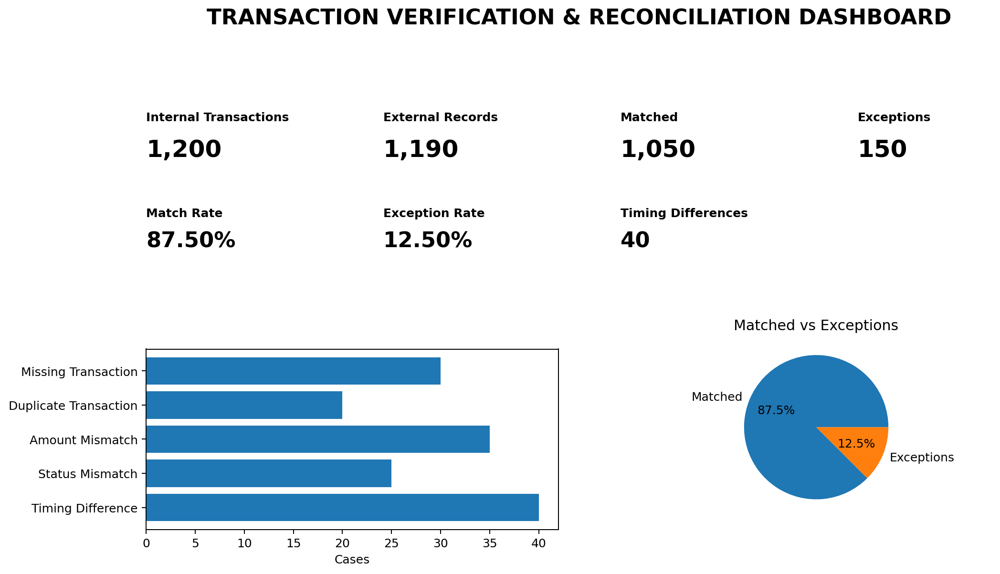

# Transaction Verification & Reconciliation Analysis



**Excel-based Finance Operations Portfolio Project | Synthetic Transaction Data**

---

## 📌 Project Overview

This project simulates a **transaction verification and reconciliation workflow** between an internal transaction system and an external settlement/statement file.

The project demonstrates how transaction records can be:

- Compared across two sources
- Validated for accuracy
- Checked for discrepancies
- Classified into exception categories
- Tracked for investigation
- Summarised using operational KPIs
- Presented through an Excel dashboard

The project is designed as a practical portfolio case study for roles related to:

**Transaction Processing | Finance Operations | Banking Operations | Reconciliation | Back Office Operations | Customer Operations | Operations Analytics**

> **Important:** This is a portfolio / academic-style project using completely synthetic data. It is not professional reconciliation work performed for a bank, payment processor, or client.

---

# 🎯 Business Problem

Transaction-processing and finance-operations teams often need to compare transaction records maintained across different systems.

Differences between systems can occur because of:

- Missing transactions
- Duplicate records
- Amount mismatches
- Status mismatches
- Settlement timing differences

Without a structured reconciliation process, these discrepancies can affect transaction reporting and create additional manual investigation work.

This project demonstrates a structured approach to identifying and classifying these differences.

---

# 🎯 Project Objectives

The main objectives were to:

1. Compare transaction records across two sources
2. Validate transaction attributes
3. Identify discrepancies
4. Classify exceptions by type
5. Maintain an exception investigation log
6. Calculate reconciliation KPIs
7. Build an operational Excel dashboard
8. Demonstrate basic transaction controls

---

# 📊 Dataset

The project uses **synthetic transaction data** created specifically for portfolio analysis.

| Source | Records |
|---|---:|
| Internal Transaction System | 1,200 |
| External Settlement File | 1,190 |

### Primary Matching Key

`Transaction ID`

### Key Fields

- Transaction ID
- Transaction Date
- Settlement Date
- Merchant
- Transaction Type
- Currency
- Transaction Amount
- Transaction Status
- Reference Number
- Source/System
- Synthetic Customer/Account Reference

No real customer, banking, payment or confidential financial data is used.

---

# 🔄 Reconciliation Workflow

The overall process follows:

```text
Internal Transaction System
          +
External Settlement File
          ↓
   Transaction ID Matching
          ↓
   Record Existence Check
          ↓
 Transaction Attribute Validation
          ↓
   Exception Identification
          ↓
   Exception Classification
          ↓
     Exception Log
          ↓
    KPI Calculation
          ↓
    Excel Dashboard
