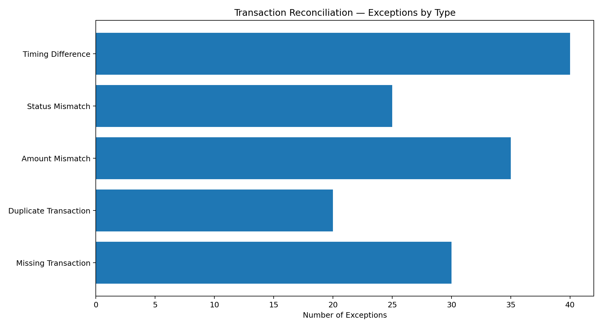

# Transaction Verification & Reconciliation Analysis


## 📌 Project Overview

This portfolio project simulates a **transaction verification and reconciliation workflow** between an internal transaction system and an external settlement/statement file.

The purpose is to demonstrate how an operations or finance-operations analyst can:

- Compare records from two sources
- Validate transaction details
- Identify mismatches and exceptions
- Classify exceptions by type
- Maintain an exception log
- Track reconciliation KPIs
- Present operational findings through an Excel dashboard

> **Portfolio / Academic-style Project — Synthetic Data**
>
> No real customer, banking, merchant or company transaction data is used.

---

## 🎯 Business Problem

In transaction-processing and finance-operations environments, records can differ between an internal system and an external settlement source because of:

- Missing transactions
- Duplicate records
- Amount differences
- Status differences
- Settlement timing differences
- Transactions appearing in only one source

A reconciliation process helps identify these differences so that exceptions can be investigated and tracked rather than being overlooked.

This project recreates that workflow using controlled synthetic data.

---

## 🎯 Project Objectives

1. Match internal transactions against external settlement records.
2. Validate key transaction attributes.
3. Identify and classify discrepancies.
4. Create an exception log for investigation.
5. Calculate reconciliation KPIs.
6. Build an operational dashboard.
7. Document a repeatable Excel-based reconciliation approach.

---

## 📊 Dataset

### Internal Transaction System

**1,200 synthetic transaction records**

### External Settlement File

**1,190 synthetic settlement records**

The datasets include fields such as:

- Transaction ID
- Transaction Date
- Settlement Date
- Merchant
- Transaction Type
- Currency
- Transaction Amount
- Transaction Status
- Reference Number
- Source/System
- Synthetic Customer/Account Reference

`Transaction ID` is used as the primary matching key.

---

## 🔍 Reconciliation Methodology

The reconciliation process follows this workflow:

```text
Internal Transactions
        ↓
External Settlement File
        ↓
Record Matching
        ↓
Attribute Validation
        ↓
Exception Classification
        ↓
Exception Log
        ↓
KPI Summary & Dashboard
```

### Matching & Validation

For each transaction, the analysis checks whether:

- The transaction exists in both sources
- The transaction is duplicated
- The transaction amount agrees
- The transaction status agrees
- The settlement date is consistent
- A timing difference exists

The output is classified into:

**Matched → Exception → Pending Investigation → Resolved**

The synthetic project deliberately creates exceptions so the reconciliation workflow can be demonstrated realistically.

---

## 📈 Reconciliation Results

| KPI | Result |
|---|---:|
| Internal Transactions | 1,200 |
| External Records | 1,190 |
| Matched Transactions | 1,050 |
| Exceptions | 150 |
| Match Rate | **87.50%** |
| Exception Rate | **12.50%** |
| Highest Exception Category | Timing Difference |
| Timing Difference Cases | **40** |

### Exception Distribution



The largest exception category in the synthetic dataset is **Timing Difference**, with **40 cases**, representing **26.67% of all exceptions**.

---

## ⚠️ Exception Types

### 1. Missing Transaction
A transaction exists in the internal source but cannot be located in the external settlement file.

### 2. Duplicate Transaction
More than one external record is associated with the same transaction identifier.

### 3. Amount Mismatch
The transaction amount differs between the internal and external records.

### 4. Status Mismatch
The transaction status differs between the two sources.

### 5. Timing Difference
The transaction exists in both sources, but the relevant dates differ within the controlled synthetic scenario.

---

## 📋 Exception Log

The project includes a dedicated **Exception Log** containing the identified exceptions.

Each exception records:

- Transaction ID
- Exception Type
- Amount
- Date
- Reason / Observation
- Priority
- Status
- Recommended Action

The exception log is designed to support structured investigation and follow-up.

**Important:** The project does not fabricate resolution outcomes. Exceptions remain classified according to the synthetic scenario unless an actual resolution is documented.

---

## 🧮 Excel Methodology

The main analysis is built in **Microsoft Excel**.

### Functions / Features Used

- `XLOOKUP`
- `IF`
- `IFERROR`
- `COUNTIF`
- `COUNTIFS`
- `SUMIF`
- `SUMIFS`
- Conditional Formatting
- PivotTables
- Filters
- Data Validation

### Example Logic

A transaction can first be checked against the external source using `XLOOKUP`.

The returned values can then be compared using logical `IF` conditions to determine whether the record is:

- Matched
- Missing
- Amount Mismatch
- Status Mismatch
- Timing Difference

Counts and values are then summarised using `COUNTIF`, `COUNTIFS`, `SUMIF` and `SUMIFS`.

---

## 📊 Operational KPI Dashboard

The Excel workbook contains a summary dashboard covering:

- Total transactions
- Matched transactions
- Exception count
- Match rate
- Exception rate
- Transaction value
- Exception value
- Exceptions by type
- Exception status
- Reconciliation overview

The dashboard is intended to provide a quick operational view rather than a financial statement.

---

## 🛡️ Controls & Risk Perspective

The project demonstrates several basic operational controls:

| Control Area | Example |
|---|---|
| Record completeness | Check transactions existing in both sources |
| Duplicate control | Identify repeated transaction IDs |
| Amount validation | Compare transaction amounts |
| Status validation | Compare transaction statuses |
| Date validation | Compare transaction and settlement dates |
| Exception management | Maintain structured exception log |
| Reporting control | Reconcile KPI totals against underlying records |

These controls help reduce the risk of inaccurate reporting, unresolved exceptions and incomplete transaction records.

---

## 💡 Key Findings

Based on the synthetic dataset:

- **1,050 transactions** were classified as matched.
- **150 transactions** were classified as exceptions.
- The overall **match rate was 87.50%**.
- The overall **exception rate was 12.50%**.
- **Timing Difference** was the largest exception category with **40 cases**.
- Exception categories provide a structured starting point for investigation and process improvement.

These findings are specific to the synthetic dataset and should not be interpreted as real-world banking performance.

---

## 🔧 Operational Recommendations

Based on the simulated reconciliation results:

1. Prioritise high-value or high-risk exceptions for investigation.
2. Review recurring timing differences to distinguish genuine settlement delays from data issues.
3. Investigate duplicate transaction patterns and strengthen duplicate controls.
4. Validate source-system fields before downstream reporting.
5. Maintain a consistent exception status and ownership process.
6. Track exception trends over time to identify recurring process weaknesses.
7. Automate repeatable matching and validation steps where appropriate.

---

## 🗂️ Repository Structure

```text
transaction-verification-reconciliation-analysis/
│
├── README.md
│
├── data/
│   ├── Internal_Transactions.csv
│   └── External_Settlement_File.csv
│
├── excel/
│   └── Transaction_Verification_Reconciliation_Analysis.xlsx
│
├── python/
│   └── generate_project.py
│
├── dashboard/
│   └── Dashboard_Notes.md
│
├── report/
│   ├── Project_Report.md
│   └── Transaction_Verification_Reconciliation_Project_Report.docx
│
└── screenshots/
    ├── reconciliation_overview.png
    └── exceptions_by_type.png
```

---

## 🛠️ Tools & Skills Demonstrated

**Primary Tool**

- Microsoft Excel

**Excel**

- XLOOKUP
- IF / IFERROR
- COUNTIF / COUNTIFS
- SUMIF / SUMIFS
- PivotTables
- Conditional Formatting
- Data Validation
- Filters

**Operations & Finance**

- Transaction Verification
- Reconciliation
- Exception Handling
- Data Validation
- Operational Reporting
- KPI Analysis
- Process Analysis
- Risk & Controls Awareness

**Supporting Tools**

- Python / Pandas for synthetic data generation and reproducibility
- Power BI concepts for operational dashboarding

---

## 📁 Main Deliverable

The main working file is:

**`excel/Transaction_Verification_Reconciliation_Analysis.xlsx`**

It contains:

- README / project instructions
- Internal transaction data
- External settlement data
- Reconciliation analysis
- Exception Log
- Summary / KPI Dashboard

---

## 🎓 Why This Project Is Relevant

This project was designed as a practical portfolio demonstration for roles such as:

- Transaction Processor
- Finance Operations Associate
- Banking Operations Associate
- Back Office Operations
- Operations Associate
- Reconciliation Analyst
- Customer Operations
- Financial Services Operations
- Data / MIS Operations

It demonstrates the underlying workflow of **record comparison → validation → exception identification → investigation tracking → operational reporting**.

---

## ⚠️ Project Limitations

This is a simulated portfolio project.

- All transaction data is synthetic.
- Customer/account identifiers are anonymised synthetic IDs.
- No real financial institution or client data is used.
- Exceptions are intentionally controlled to demonstrate different reconciliation scenarios.
- No real transaction exception has been independently resolved.
- The project does not claim professional banking reconciliation experience.

---

## 👤 Author

**Mark Maxwel Louis**

M.Sc. Accounting & Business Intelligence — Brunel University London

B.Com (Hons.) Accounting & Finance — Quantum University

Areas of interest:

**Finance Operations | Transaction Processing | Reconciliation | Operations Analytics | Data Validation | MIS & Reporting**

---

## 📌 Portfolio Note

This project is intended to demonstrate practical understanding of transaction verification and reconciliation concepts through a controlled synthetic case study.

It should be viewed as a **portfolio project**, not as professional work performed for a bank, payment processor, merchant or financial institution.
